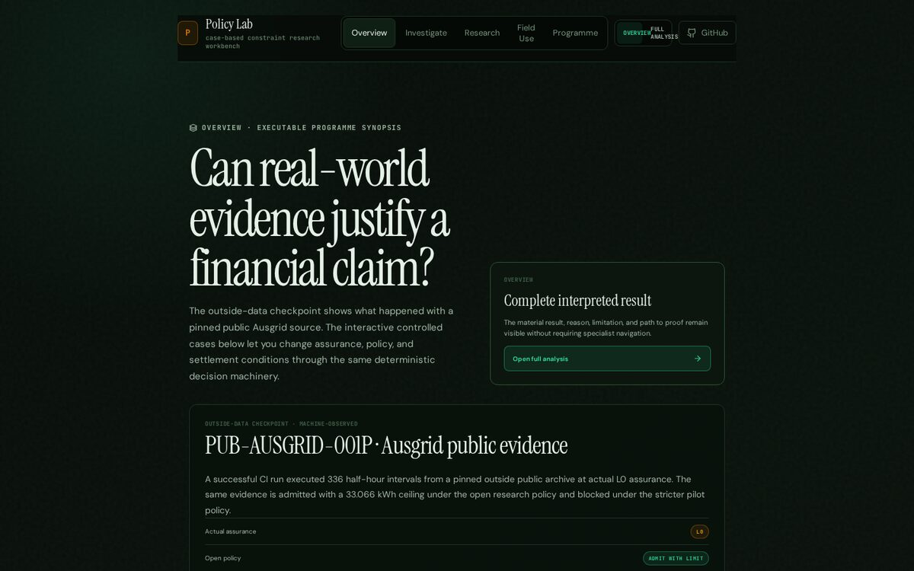

# Policy Lab

**Can real-world evidence justify a financial claim? Policy Lab is a workbench for testing that case by case: what the evidence supports, what a policy blocks, how much can be admitted, and what fails at settlement.**



**Try it:** <https://spectating101.github.io/solarpunk-coin/demo/> — runs in the browser, no install.

Each case pairs evidence (for example, metered electricity data) with a versioned policy. The workbench classifies how trustworthy the evidence is, applies the policy, sets a quantity ceiling, and stress-tests settlement, keeping every input and decision so the result can be reproduced.

| | |
|---|---|
| **Outside-data check** | A CI run pulls 336 half-hour intervals from a pinned public Ausgrid archive. The same evidence is admitted with a 33.066 kWh ceiling under the open research policy and blocked under the stricter pilot policy |
| **Controlled cases** | An interactive case pack where you change assurance, policy and settlement conditions and watch the decision change |
| **Portable output** | Each assessment exports as a versioned claim-assessment package |
| **Engineering** | Deterministic decision core, JSON-schema-bound outputs, CI-published site with a post-deploy smoke test |
| **Status** | Public research workbench. Not a token, not a financial product, not a claim that any energy-linked instrument is money |

Where everything lives, and which files are authority: [`docs/SOURCE_OF_TRUTH.md`](docs/SOURCE_OF_TRUTH.md), with the machine-declared surface in [`CURRENT_SURFACE.json`](./CURRENT_SURFACE.json).

Policy Lab grew out of the earlier SolarPunk energy-standard research; that material is kept under *Historical SolarPunk / SPK material* below.

## Decision model

```text
case
  ↓
evidence + modeled context
  ↓
assurance classification
  ↓
versioned policy
  ↓
admission gates
  ↓
quantity ceilings
  ↓
deterministic decision
  ↓
settlement stress
  ↓
receipt / lineage / portable assessment package
```

The implementation stages are deliberately separate from the research boundaries R1–R4. Passing one stage or boundary never automatically upgrades the next.

## Two evidence classes are intentionally separate

### Controlled interactive case pack

The browser workbench currently exposes five controlled mechanism cases:

- `TYN-001`
- `AUS-001`
- `PHX-001`
- `OPS-001`
- `CPT-001`

The pack declares `empirical_claim: false`. These cases test decision structure, policy divergence, assurance counterfactuals, quantity ceilings, settlement behavior, receipts, and reproduction. They are not independent empirical validation.

### Outside-data checkpoint

`PUB-AUSGRID-001P` is a separate externally sourced public-data checkpoint executed in CI. It is **not** silently promoted into the controlled browser case pack.

Current frozen checkpoint facts include:

- actual assurance: `L0`;
- 336 half-hour intervals;
- 33.066 kWh eligible derived surplus;
- open policy: `ADMIT_WITH_LIMIT` at 33.066 `ENERGY_CLAIM_UNIT`;
- pilot policy: `BLOCKED`;
- 40% settlement stress: `PARTIAL`, 13.2264 covered / 19.8396 shortfall;
- closed-world decision reproduction: `PASS`;
- R4 monetary performance: `UNTESTED`.

This demonstrates bounded outside-data operability and reproducibility. It does not establish owner/operator confirmation, physical meter truth, legal issuance authority, production pricing, governance adequacy, or monetary adoption.

## Portable claim assessment

The external-case workflow also builds and independently verifies:

```text
policylab.claim_assessment_package.v0.1
profile: policylab.energy_linked_claim.v0
```

The package preserves evidence identity, policy identity, structured rule evaluations, bounded quantity, optional settlement, explicit non-claims, and research-boundary projection. It has separate semantic `assessment_id` and complete `package_content_id` identities.

CI requires:

1. agreement with the closed source artifacts;
2. deterministic identity reproduction;
3. exact human-report rendering from the machine package;
4. byte-identical package and report rebuilds.

The package is a portable rendering of Policy Lab results. Packaging does not create new evidence authority.

## Submission / Gauntlet package

Policy Lab now has a separate judge-facing package for suitable competitions and research-software routes. It is downstream of executable truth and cannot override eligibility, semantic-fit, or evidence boundaries.

Start at [`docs/submission/README.md`](./docs/submission/README.md).

Central submission hook:

> **If a financial claim says real-world evidence backs it, Policy Lab makes it prove exactly how much that evidence can justify.**

The machine-bound submission facts live in [`benchmark/gauntlet/submission-package.v1.json`](./benchmark/gauntlet/submission-package.v1.json) and are checked against the current outside-data checkpoint by:

```bash
node scripts/validate_gauntlet_submission_package.mjs
```

The package includes the master judge narrative, 30/90-second demo scripts, Q&A, route-specific adapters, and a submission-readiness checklist. It does not promote the current outside-data checkpoint into a pilot or commercial validation claim.

## Canonical commands

The root Node package is intentionally private. Current entry commands are:

```bash
npm run policy-lab:surface
npm run policy-lab:preflight
npm run policy-lab:test-core
npm run policy-lab:test-frontend
npm run policy-lab:build
```

For interactive development:

```bash
cd frontend
npm install
npm run dev
```

The repository still contains many older `spk:*`, `foundation:*`, `product:*`, `thesis:*`, contract, meter, and pilot commands. They are preserved for historical reproduction and reference work; they do not define the current Policy Lab release path.

## Current release path

```text
CURRENT_SURFACE.json
  ↓
Policy Lab preflight
  ↓
constraint-core + frontend tests
  ↓
Vite build
  ↓
GitHub Pages mirror
  ↓
live production smoke
```

Publishing no longer depends on historical SPK contract state, peg state, network-payment history, Foundation cycles, or legacy product-launch gates.

## Governance, privacy, security, and public interest

The current Policy Lab public-governance surface is explicit and machine-declared:

- [`GOVERNANCE.md`](./GOVERNANCE.md) — ownership, maintainership, contribution and release authority;
- [`PRIVACY.md`](./PRIVACY.md) — browser-local evidence handling, PII boundaries, hosting, and legal scope;
- [`SECURITY.md`](./SECURITY.md) — supported security surface and sensitive reporting path;
- [`CODE_OF_CONDUCT.md`](./CODE_OF_CONDUCT.md) — contributor/community safety and moderation;
- [`PUBLIC_INTEREST.md`](./PUBLIC_INTEREST.md) — SDG relevance, do-no-harm controls, and impact non-claims.

These documents describe the **current research-software surface**. They do not turn historical reference code into production infrastructure and do not claim that Policy Lab has already been recognized by an external public-good registry.

A separate integrity check, `scripts/check_public_governance.mjs`, tests material privacy/ownership/safety statements against the current runtime and citation metadata.

## Historical SolarPunk / SPK material

SolarPunk, SPK v1, Sepolia contracts, currency experiments, Foundation/operator machinery, thesis tooling, and older product experiments remain in the repository because they are part of the research lineage and may still be useful for reproduction.

They are secondary/reference surfaces. Historical scheduled writers, legacy deploy workflows, and the old `spk-derivatives` release publisher have been removed from active GitHub Actions and archived under `archive/github-workflows/`.

The live app retains explicit historical/reference routes where those systems can still be inspected without redefining the current project.

## Non-claims

Policy Lab does not currently claim:

- source-holder or operator validation for the public Ausgrid case;
- physical meter truth from derived public data;
- legal issuance or redemption authority;
- production-grade custody, pricing, or governance;
- certification or regulatory approval;
- product-market fit or commercial demand;
- circulation, liquidity, medium-of-exchange acceptance, or monetary status.

A receipt proves deterministic lineage. A package proves reproducible packaging. Neither proves the real-world fact or legal authority represented by the underlying evidence.

## Repository rule

When code, generated artifacts, workflows, and old prose disagree, investigate the executable objects first. Update `CURRENT_SURFACE.json` and its integrity checks when the canonical surface genuinely changes.
