# Production vs Consumption — CEIR vs SPK

**Exploration doc (not thesis).** Answers: *“If CEIR studies Bitcoin mining burn, why does SPK mint from rooftop surplus?”*

---

## Two sides of “energy and money”

```mermaid
flowchart LR
  subgraph consumption [Consumption side — CEIR]
    BTC[Bitcoin PoW]
    MINE[Miners burn kWh]
    CBECI[Cambridge CBECI estimates]
    MCAP[Market cap / cumulative cost]
    CEIR[CEIR → forward returns]
  end
  subgraph production [Production side — SPK]
    PV[Rooftop / inverter export]
    METER[Signed meter readings]
    SURPLUS[Verified surplus kWh]
    MINT[mintFromSurplusAttestation]
    SPK[SPK circulation]
  end
  consumption -->|"conditional signal only"| MOTIVE[Motivation: energy info exists]
  MOTIVE --> production
```

| Dimension | Bitcoin / CEIR | SolarPunk SPK |
|-----------|----------------|---------------|
| **Energy link** | Indirect — security via PoW burn | Direct — issuance from surplus export |
| **Physical claim** | None for holders | Optional owed-kWh redemption accounting |
| **Data source** | Modelled network electricity (Cambridge) | Meter / inverter attestations (pilot) |
| **Issuance rule** | Protocol + mining competition | Attested surplus + replay-safe hash |
| **What empirics test** | Does cost **ratio** predict returns? | Can **rules** run on testnet? |
| **Fragility found** | Regime break (China ban); weak post-ban | Oracle, delivery, peg — exploration Tier C |
| **Thesis role** | Ch 3 — bounds passive hope | Ch 5 / repo — designed mechanism |

---

## How CEIR motivates SPK without proving it

**Valid:**

1. Energy-cost information **can** appear in digital asset markets (pre-ban CEIR).
2. That information is **not stable** when network structure shifts (Chow break).
3. Bitcoin does **not** give users a settlement path for that energy — burn ≠ claim.
4. Therefore a serious energy-money design needs **explicit** data, issuance, pricing, settlement, governance.

**Invalid:**

- “CEIR β = −0.26 → mint 1 SPK per kWh will work.”
- “Post-ban CEIR weak → energy doesn’t matter → don’t build SPK.”

---

## Stitch sentence (grants / README)

> CEIR tests whether **passive** proof-of-work anchoring disciplines Bitcoin valuation; it does, but only conditionally. SPK tests whether **active** surplus attestation can discipline issuance and settlement on testnet. Same energy theme, opposite architecture — consumption inference vs production evidence.

---

## Repo evidence anchors

| Artifact | Side |
|----------|------|
| `thesis_package/ceir_regression.py` | Consumption / CEIR |
| `state/attestations/latest_attestation_bundle.json` | Production / meter |
| Sepolia tx `0x352758…` | Meter-scaled mint on SPK v1 |
| `state/runtime/spk_v1.json` | Operations log (`mint_mode: meter`) |

Refresh status: `npm run exploration:tier-c`
