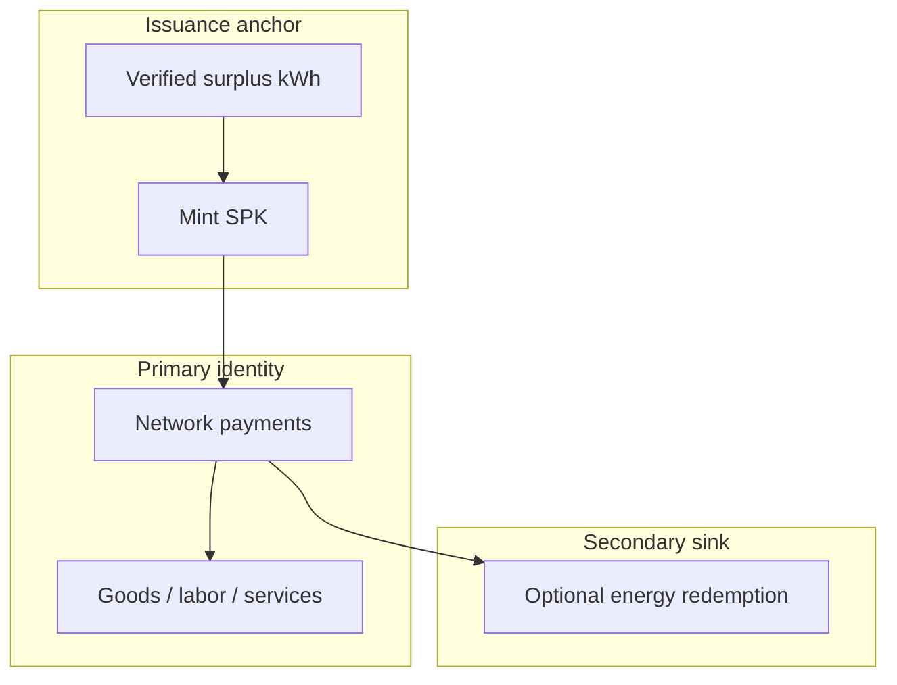

# SPK as Network Money

Design note for the circulation-first monetary model: energy-backed issuance, network settlement as the primary identity, optional energy redemption as a secondary exit.

## The problem we are solving

| Trap | Symptom |
|------|---------|
| **Dollar peg** | SPK becomes a dollar wrapper, not its own currency system |
| **Energy-only + redemption-first** | SPK reads as a utility coupon ("electricity company scrip") |

This stack tries a third path:

> **Issue against verified surplus energy. Circulate as network money. Redeem for energy only as an optional exit.**

## Three layers



### 1. Issuance anchor (energy-native)

New SPK only appears when surplus energy is attested.

- Default: **1 SPK ≈ 1 kWh** of issuance backing (`kwhPerSpkWad`)
- **No dollar in the mint formula**
- `referenceUsdPerKwh` is a **quote for dashboards**, not a peg
- `pegEnabled` defaults **false** — no PI chase of $1 unless explicitly turned on

Energy is the **proof of production**, not the public brand.

### 2. Primary identity: network circulation

`SolarPunkCurrencySystem` models SPK as **settlement money between participants**:

- `settleNetworkPayment(payee, amount, invoiceHash, paymentKind)` — replay-safe invoice router
- Payment kinds: `GOODS`, `SERVICE`, `LABOR`, `NETWORK`
- `networkMetrics()` — circulation vs redemption share on-chain

This is the "gold notes circulated, most never redeemed" pattern:

- Producers pay gateways, maintenance, buyers
- Buyers pay merchants
- Merchants pay producers back

**Money behavior = who accepts SPK for real work and goods.**

### 3. Secondary sink: optional energy exit

`openRedemption` burns SPK and records owed kWh for off-chain delivery.

- Not the headline product
- Can be **disabled** via `setRedemptionEnabled(false)` if the network wants circulation-only phase
- Demo targets **~95% circulation / ~5% redemption** activity mix

## Contract surface

| Function | Role |
|----------|------|
| `settleInvoice` | Backward-compatible network payment (untagged) |
| `settleNetworkPayment` | Tagged circulation payment |
| `networkMetrics` | Circulation vs redemption shares |
| `settledSpkByPaymentKind` | Aggregate by GOODS/SERVICE/LABOR/NETWORK |
| `setRedemptionEnabled` | Gate optional energy exit |
| `openRedemption` | Secondary sink (requires enabled) |

**SolarPunkCoin** (issuance):

| Setting | Default | Meaning |
|---------|---------|---------|
| `issuanceMode` | energy-native | Mint from kWh, not USD |
| `pegEnabled` | false | No dollar peg overlay |
| `referenceUsdPerKwh` | 0 | Optional implied USD view |

## Run the demos

```bash
# Full on-chain circulation flow (Hardhat)
npm run product:network-circulation

# Lab ledger + four-layer artifact
npm run product:currency-lab
```

Outputs:

- `state/product/network_circulation_demo.json`
- `docs/product/NETWORK_CIRCULATION_DEMO.md`
- `state/product/currency_system_lab.json`

## What this does NOT claim

- Not a launched currency or legal tender
- Not an electricity retailer
- Not a dollar stablecoin (peg off by default)
- Physical kWh delivery, regulation, and oracle trust remain off-chain research questions

## Thesis one-liner

**SPK is network settlement money issued only when surplus energy is proven — circulated between participants, with energy redemption as an optional exit, not the product identity.**
