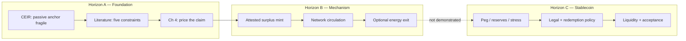

# Integrated Thesis Reinvention — Exploration Draft

**Status:** Exploration only. **Does not replace** the grounded manuscript (`CHAPTER_*_GROUNDED_DRAFT.md`, `THESIS_SOURCE_OF_TRUTH.md`).

**Purpose:** Sketch how a *future* thesis (or post-thesis monograph / design bible) could tell **one integrated story** — empirical motivation → designed monetary unit → testnet mechanism → stablecoin horizon — with the **repo treated as first-class evidence**, not a Chapter 5 footnote.

**Audience:** You, collaborators, grant reviewers, future you. Not the examiner unless you deliberately choose a second submission track.

---

## 0. Design principle

| Current grounded thesis | This exploration |
|-------------------------|------------------|
| Academic bounds first; SPK is feasibility appendix | **Single arc:** constraint design → network money → stablecoin horizon |
| Bitcoin empirics are the empirical center | Bitcoin empirics are **motivation for architecture**, not the product |
| Stablecoin mentioned as comparator / “step before” | Stablecoin is **explicit Chapter 7 horizon**, clearly unproven |
| Repo evidence in §5.10 | Repo is **woven through** theory + empirics + implementation |
| Six chapters, one RQ | Six core chapters + **integrated spine** document |

**Rule:** Keep all **bounded claims** from `THESIS_SOURCE_OF_TRUTH.md`. Change **framing and threading**, not the numbers.

---

## 1. Proposed title (exploration)

**Primary (integrated):**

> **From Passive Anchor to Designed Money: Energy Constraints, Network Settlement, and the Path to a Credible Stable Unit**

**Subtitle (optional):**

> Empirical limits of proof-of-work anchoring, rule-bound issuance on Ethereum testnet, and what remains before dollar parity

**Why different:** Current title (`Energy as a Constraint: Credibility, Pricing, and Settlement…`) is examiner-safe and correct. The exploration title names the **journey** (passive → designed → stable horizon) that thesis + repo already imply.

---

## 2. One-sentence thesis (integrated)

> Passive energy linkage in digital markets is conditional and fragile; a credible energy-anchored monetary unit therefore requires explicit rules for data, issuance, pricing, settlement, and governance — demonstrable on testnet as circulation-first network money, and only *after further evidence* defensible as a dollar-stablecoin.

---

## 3. The integrated spine (new front matter)

Add a **2–3 page “Project spine”** before Chapter 1 (or as §1.0) that never appears in the cautious submission version but makes integration obvious:

### 3.1 Three horizons (one table, one diagram)

| Horizon | Name | What is claimed | Where evidenced |
|---------|------|-----------------|-----------------|
| **A** | Foundation | Energy can constrain digital finance **only under rules** | Ch 2–5 + canonical empirics |
| **B** | Mechanism | Those rules can **run as network money** on a public testnet | SPK v1 Sepolia + `state/runtime/spk_v1.json` |
| **C** | Stablecoin | Dollar parity, reserves, law, liquidity **not proved here** | Explicit “future work” + FSB-style checklist |



### 3.2 Artifact map (thesis ↔ repo)

| Repo artifact | Integrated thesis role |
|---------------|------------------------|
| `thesis_package/ceir_regression.py` + CSVs | Ch 3 reproducibility; falsifies passive hope |
| `energy_derivatives/spk_derivatives/` | Ch 4 pricing engine |
| `contracts/SolarPunkCoin.sol` | Ch 5 issuance constraint |
| `contracts/SolarPunkCurrencySystem.sol` | Ch 5 settlement + circulation identity |
| `spk_v1/` sync + evidence | Ch 5–6 **living results** (metrics refresh) |
| `docs/product/NETWORK_MONEY.md` | Ch 5 product constitution (cite as design spec) |
| `thesis_package/INSTRUMENT_COMPARISON.md` | Ch 2 comparator table |
| `docs/product/CURRENCY_THEORY_AND_COMPARABLES.md` | Ch 2 + Ch 7 (stablecoin bar) |

### 3.3 What integration does *not* mean

- Does **not** claim SPK v1 is a launched stablecoin.
- Does **not** merge product marketing tone into examiner chapters.
- Does **not** re-run CEIR to “prove” mint economics.
- Does **not** require rewriting Ch 3–4 numbers.

---

## 4. Chapter-by-chapter reinvention

### Chapter 1 — Introduction: The full arc in one chapter

**Current:** Problem → RQ → three evidence paths → scope.

**Reinvention adds:**

- §1.0 **Reader map:** “You are reading the foundation leg of a stablecoin-direction project; implementation evidence lives in SPK v1; dollar peg is horizon C.”
- §1.2 **Two failure modes** the project avoids:
  1. *Slogan money* — “energy backs it” without rules.
  2. *Dollar wrapper* — peg without anchor discipline.
- §1.4 **Research question (unchanged core):**  
  `Can energy act as a credible constraint for digital money through energy-linked financial contracts, and what conditions are needed for that constraint to work?`
- **Sub-question (new, labeled exploratory):**  
  `If those conditions are implemented as circulation-first network money, what additional layers are required before dollar-stablecoin claims become empirically defensible?`
- §1.5 **Evidence path as ladder** (not three parallel projects):

```text
Ch 3  →  why passive anchoring fails
Ch 4  →  how to price energy-linked claims
Ch 5  →  how designed rules run (SPK v1)
Ch 6  →  what is proved vs deferred
Ch 7* →  stablecoin launch gate (*exploration only)
```

**Reuse from grounded draft:** §§1.1–1.3 motivation, 1.6 scope, most of 1.5 contributions — **paste with light reframing**.

---

### Chapter 2 — Monetary design space (not “lit review only”)

**Current:** Gold, fiat, Bitcoin, renewables, pricing lit, five constraints preview, stablecoin comparator §2.9.

**Reinvention structure:**

| Section | Content |
|---------|---------|
| 2.1 | Credibility without convertibility (gold → fiat → code) |
| 2.2 | **Rail vs money** — ETH/XRP as infrastructure, not competitors |
| 2.3 | **Instrument comparison table** — USDC / DAI / BTC / SPK (from `INSTRUMENT_COMPARISON.md`) |
| 2.4 | Passive PoW anchor (Bitcoin) vs active rule-bound anchor (SPK design) |
| 2.5 | Renewable surplus as issuance input (not mining burn) |
| 2.6 | Pricing + oracle literature bridge to Ch 4 |
| 2.7 | **Five constraints** as minimum architecture |
| 2.8 | **Three product layers** — issuance / circulation / exit (`NETWORK_MONEY.md`) |
| 2.9 | **Step before stablecoin** (keep grounded §2.9 verbatim) + FSB high-level recommendations as *future bar* |

**Integration move:** Ch 2 ends with: *“Chapter 3 tests the passive path; Chapters 4–5 test the designed path; Chapter 7 lists stablecoin gaps.”*

---

### Chapter 3 — CEIR: Falsifying the passive path

**Current:** Methods, results, robustness, trading rule negative, China ban.

**Reinvention framing (same empirics):**

| Section | Reframe |
|---------|---------|
| Opening | “This chapter is **not** about SolarPunk returns. It tests whether **markets already treat energy as a sufficient anchor** in Bitcoin.” |
| §3.1 | **Prior CEIR lineage** (new half-page): earlier standalone CEIR work → this thesis uses a **slimmed daily reproducible spec**; differences documented in appendix |
| §3.5 Results | Same canonical coefficients |
| §3.6 Robustness | Differenced spec + trading rule = **boundaries** |
| Closing | **Bridge paragraph (new):** |

> If cumulative mining cost does not reliably discipline Bitcoin valuation after structural shocks, then an energy-anchored monetary unit cannot rely on passive inference from burn. It must use **verified surplus, explicit issuance, and ledgered settlement** — the architecture tested in Chapter 5.

**Repo link:** `ceir_regression.py`, `CEIR_TO_SPK_LITERATURE_BRIDGE.md` as appendix (not main text if examiner prefers slim).

---

### Chapter 4 — Pricing: USD translation without peg promise

**Current:** Taiwan base case, cross-location ATM, oracle tolerance.

**Reinvention adds one integration subsection:

**§4.8 From priced claim to monetary expression**

- `referenceUsdPerKwh` is **numéraire / dashboard translation**, not peg.
- Oracle tolerance table → **maximum attestation error** before issuance/pricing breaks.
- Connect to SPK: mint is kWh-native; USD enters through **Ch 4 machinery**, not issuer promise of $1.

**Reuse:** All canonical pricing tables unchanged.

---

### Chapter 5 — Designed money: constraints + SPK v1 as co-equal evidence

**Current:** Five constraints + POC + §5.10 SPK v1.

**Reinvention:** Elevate SPK v1 from “late subsection” to **chapter co-structure**:

| Part | Title | Source |
|------|-------|--------|
| **5.A** | Constraint specification (theory) | Current §5.2–5.6 |
| **5.B** | **Monetary constitution** — circulation-first, peg off | `NETWORK_MONEY.md` |
| **5.C** | **Implementation architecture** | Contracts + roles diagram |
| **5.D** | **Public testnet evidence** | `SPK_V1_EVIDENCE.md`, Table 5.3 txs |
| **5.E** | **Operator loop** | `spk-v1 sync`, cycle scripts |
| **5.F** | Launch gates (research vs production) | Current §5.7 + `CURRENCY_THEORY` scorecard |

**New table — Five constraints × SPK v1 surface:**

| Constraint | Rule | On-chain / ops evidence |
|------------|------|-------------------------|
| Data | Surplus attestation | Attested mint path, meter bundle option |
| Issuance | No mint without accepted kWh | `mintFromSurplus`, energy-native mode |
| Pricing | Explicit USD/kWh reference | `referenceUsdPerKwh` + Ch 4 |
| Settlement | Replay-safe payments | `settleNetworkPayment`, invoice hashes |
| Governance | Bounded roles | Admin roles; multisig planned |

**Metrics block (live or frozen at build):**

- Supply, circulation share, payment count, peg off — from `FOUNDATION_EVIDENCE.md`.

**Closing (integrated):**

> Chapter 5 does not prove a stablecoin. It proves that **Horizon B** — rule-bound network money with energy-native issuance — is **technically instantiateable** and **publicly auditable** on testnet. Horizon C remains conditional on evidence not collected here.

---

### Chapter 6 — Conclusion: Bounded answer + explicit deferrals

**Current:** Summary, limitations, falsifiers.

**Reinvention adds §6.8 **Integration summary** (half page):

| Layer | Verdict |
|-------|---------|
| Passive energy anchor | Conditionally observed; not sufficient |
| Designed constraint stack | Specified and partially implemented |
| Network money on testnet | Demonstrated (SPK v1) |
| Dollar stablecoin | **Deferred** — requires peg, reserves, law, adoption |

**Reuse:** Ch 6 falsification list + add peg-stress and circulation-audit items from `MONETARY_FOUNDATION.md`.

---

### Chapter 7 — Stablecoin horizon (exploration-only chapter)

*Not in current submission. Optional monograph / Part II / grant appendix.*

**Purpose:** Name everything thesis + repo **intentionally skip** but stablecoin project **must** eventually address.

| § | Topic | Repo hook today |
|---|-------|-----------------|
| 7.1 | Peg on vs peg off; PI band experiments | `simulate_peg.py`, `pegEnabled` |
| 7.2 | Reserve / collateral policy | Not implemented |
| 7.3 | Legal classification + redemption terms | `ENERGY_STANDARD_ECONOMICS.md` |
| 7.4 | FSB-style control functions | `CURRENCY_THEORY` checklist |
| 7.5 | Real meter finality + operator liability | Meter bundle path; not production |
| 7.6 | Liquidity, merchants, wallet UX | Demo UI only |
| 7.7 | **Launch gate scorecard** | Pass/fail table (mostly fail today — honest) |

**Sample launch gate (exploration):**

| Gate | Required for stablecoin claim | Status (Jun 2026) |
|------|------------------------------|-------------------|
| Reproducible foundation empirics | Yes | Pass |
| Constraint stack on public testnet | Yes | Pass |
| Peg stress under oracle bands | Yes | Not demonstrated |
| Legal redemption policy | Yes | Not demonstrated |
| Audited mainnet | Yes | Out of scope |
| Non-lab circulation | Yes | Not demonstrated |

---

## 5. Abstract (integrated exploration draft)

Digital money can be scarce in code without being credible in economics. This work studies whether **energy** can act as a **verifiable constraint** on digital financial claims when embedded in explicit rules for data, issuance, pricing, settlement, and governance. Using Bitcoin as an empirical case, I show that valuation relative to cumulative mining electricity cost (CEIR) relates negatively to subsequent returns in a preferred level specification before the China mining-ban period, weakens afterward, and does not support a profitable trading rule — implying that **passive energy anchoring is conditional, not automatic**. I develop a transparent pricing framework for renewable-energy-linked claims with oracle-tolerance analysis, then specify a five-constraint architecture for credible energy-linked finance and implement it as **SPK v1**, a circulation-first network-money prototype on Ethereum Sepolia with energy-native issuance, typed network payments, and optional energy redemption with **peg disabled by default**. The thesis contributes a bounded foundation for energy-anchored monetary design: it demonstrates feasibility of the **mechanism layer** and identifies what remains before **dollar-stablecoin** claims can be empirically defended. It does not claim production readiness, legal tender, or market adoption.

---

## 6. What to reuse verbatim vs rewrite

| Keep as-is (high confidence) | Reframe only | New writing |
|------------------------------|--------------|-------------|
| Ch 3 regression tables + CEIR defs | Ch 3 opening/closing bridge | Prior CEIR lineage § |
| Ch 4 pricing tables + oracle tolerance | Ch 4 §4.8 USD translation | — |
| Ch 2 five constraints + §2.9 stablecoin | Ch 2 instrument table placement | Rail vs money §2.2 |
| Ch 5 constraint definitions | Ch 5 SPK as co-structure | Five × SPK table |
| Ch 6 limitations + falsifiers | Ch 6 integration summary | — |
| `THESIS_SOURCE_OF_TRUTH` numbers | Abstract | Ch 7 entire chapter |
| Advisor “do not claim” list | — | Launch gate scorecard |

**Estimated effort if you ever executed this:** ~15–25% new prose, ~10% moved sections, ~65% retained grounded text.

---

## 7. Risks of executing this reinvention

| Risk | Mitigation |
|------|------------|
| Overclaiming stablecoin | Keep Ch 7 separate; repeat “peg off” in Ch 5 |
| Examiner thinks it’s a product pitch | Submit grounded version; keep this as internal |
| CEIR ↔ SPK over-bridge | One bridge paragraph + appendix; CEIR does not prove mint |
| Metrics go stale | `npm run thesis:foundation` before any export |
| Contradicting repo | Anchor on `THESIS_PRODUCT_ALIGNMENT.md` + runtime JSON |

---

## 8. Recommendation

| Question | Answer |
|----------|--------|
| Should you replace the submission thesis with this? | **No** — current grounded build is mature and advisor-ready |
| Is this exploration useful? | **Yes** — clarifies thesis + repo + stablecoin as **one project narrative** |
| Best use of this doc | Grant drafts, README/strategy, post-defense monograph, collaborator onboarding |
| Smallest high-value steal | **Spine §3.1–3.2** + **Ch 3 bridge paragraph** + **Ch 5 five×SPK table** — without restructuring |

---

## 9. Next steps (optional, only if you want to experiment)

1. Paste §3.1 three-horizons table into `SUBMIT_TO_ADVISOR.md` as optional “project context” — not in manuscript.
2. Add Ch 3 bridge paragraph to grounded draft **only if advisor asks how CEIR connects to implementation**.
3. Generate `FOUNDATION_EVIDENCE.md` and drop Table 5.3 metrics into Word once before send.
4. Keep Ch 7 as this file’s §7 — do not add to `THESIS_GROUNDED.docx` unless you open a **second publication track**.

---

*Exploration draft — 2026-06-08. Canonical submission remains `CHAPTER_*_GROUNDED_DRAFT.md` + `npm run thesis:docx`.*
